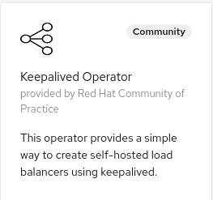

# Keepalived operator


[](https://goreportcard.com/report/github.com/redhat-cop/keepalived-operator)


The objective of the keepalived operator is to allow for a way to create self-hosted load balancers in an automated way. From a user experience point of view the behavior is the same as of when creating [`LoadBalancer`](https://kubernetes.io/docs/concepts/services-networking/service/#loadbalancer) services with a cloud provider able to manage them.

The keepalived operator can be used in all environments that allows nodes to advertise additional IPs on their NICs (and at least for now, in networks that allow multicast), however it's mainly aimed at supporting LoadBalancer services and ExternalIPs on bare metal installations (or other installation environments where a cloud provider is not available).

One possible use of the keepalived operator is also to support [OpenShift Ingresses](https://docs.openshift.com/container-platform/4.5/networking/configuring_ingress_cluster_traffic/overview-traffic.html) in environments where an external load balancer cannot be provisioned. See this [how-to](./Ingress-how-to.md) on how to configure keepalived-operator to support OpenShift ingresses

## How it works

The keepalived operator will create one or more [VIPs](https://en.wikipedia.org/wiki/Virtual_IP_address) (an HA IP that floats between multiple nodes), based on the [`LoadBalancer`](https://kubernetes.io/docs/concepts/services-networking/service/#loadbalancer) services and/or services requesting [`ExternalIPs`](https://kubernetes.io/docs/concepts/services-networking/service/#external-ips).

For `LoadBalancer` services the IPs found at `.Status.LoadBalancer.Ingress[].IP` will become VIPs.

For services requesting a `ExternalIPs`, the IPs found at `.Spec.ExternalIPs[]` will become VIPs.

Note that a service can be of `LoadBalancer` type and also request `ExternalIPs`, it this case both sets of IPs will become VIPs.

Due to a [keepalived](https://www.keepalived.org/manpage.html) limitation a single keepalived cluster can manage up to 256 VIP configurations. Multiple keepalived clusters can coexists in the same network as long as they use different multicast ports [TODO verify this statement].

To address this limitation the `KeepalivedGroup` [CRD](https://kubernetes.io/docs/concepts/extend-kubernetes/api-extension/custom-resources/) has been introduced. This CRD is supposed to be configured by an administrator and allows you to specify a node selector to pick on which nodes the keepalived pods should be deployed. Here is an example:

```yaml
apiVersion: redhatcop.redhat.io/v1alpha1
kind: KeepalivedGroup
metadata:
  name: keepalivedgroup-router
spec:
  image: registry.redhat.io/openshift4/ose-keepalived-ipfailover
  interface: ens3
  nodeSelector:
    node-role.kubernetes.io/loadbalancer: ""
  blacklistRouterIDs:
  - 1
  - 2  
```

This KeepalivedGroup will be deployed on all the nodes with role `loadbalancer`. Keepalived requires knowledge of the network device on which the VIPs will be exposed. If the interface name is the same on all nodes, it can be specified in the `interface` field. Alternatively, the `interfaceFromIP` field can be set to an IPv4 address to enable interface autodiscovery. In this scenario, the `interface` field will be ignored and each node in the KeepalivedGroup will expose the VIPs on the interface that would be used to reach the provided IP.

Services must be annotated to opt-in to being observed by the keepalived operator and to specify which KeepalivedGroup they refer to. The annotation looks like this:

`keepalived-operator.redhat-cop.io/keepalivedgroup: <keepalivedgroup namespace>/<keepalivedgroup-name>`

The image used for the keepalived containers can be specified with `.Spec.Image` it will default to `registry.redhat.io/openshift4/ose-keepalived-ipfailover` if undefined.

## Requirements

### Security Context Constraints

Each KeepalivedGroup deploys a [daemonset](https://kubernetes.io/docs/concepts/workloads/controllers/daemonset/) that requires the [privileged scc](https://docs.openshift.com/container-platform/4.5/authentication/managing-security-context-constraints.html), this permission must be given to the `default` service account in the namespace where the keepalived group is created by and administrator.

```shell
oc adm policy add-scc-to-user privileged -z default-n <keepalivedgroup namespace>
```

### Cluster Network Operator

In Openshift, use of an external IP address is governed by the following fields in the `Network.config.openshift.io` CR named `cluster`

* `spec.externalIP.autoAssignCIDRs` defines an IP address block used by the load balancer when choosing an external IP address for the service. OpenShift supports only a single IP address block for automatic assignment.

* `spec.externalIP.policy` defines the permissible IP address blocks when manually specifying an IP address. OpenShift does not apply policy rules to IP address blocks defined by `spec.externalIP.autoAssignCIDRs`

The following patch can be used to configure the Cluster Network Operator:

```yaml
spec:
  externalIP:
    policy:
      allowedCIDRs:
      - ${ALLOWED_CIDR}
    autoAssignCIDRs:
      - "${AUTOASSIGNED_CIDR}"
```

Here is an example of how to apply the patch:

```shell
export ALLOWED_CIDR="192.168.131.128/26"
export AUTOASSIGNED_CIDR="192.168.131.192/26"
oc patch network cluster -p "$(envsubst < ./network-patch.yaml | yq r -j -)" --type=merge
```

Additionally, the fields can be edited manually via `oc edit Network.config.openshift.io cluster`

## Blacklisting router IDs

If the Keepalived pods are deployed on nodes which are in the same network (same broadcast domain to be precise) with other keepalived the process, it's necessary to ensure that there is no collision between the used routers it.
For this purpose it is possible to provide a `blacklistRouterIDs` field with a list of black-listed IDs that will not be used.

## Spreading VIPs across nodes to maximize load balancing

If a service contains multiple externalIPs or LoadBalancer IPs, it is possible to instruct keepalived-operator to maximize the spread of such VIPs across the nodes in the KeepalivedGroup by specifying the `keepalived-operator.redhat-cop.io/spreadvips: "true"` annotation on the service. This option ensures that different VIPs for the same service are always owned by different nodes (or, if the number of nodes in the group is less than the number of VIPs, that the VIPs are assigned maximizing the spread), to avoid creating a traffic bottleneck. However, in order to achieve this, keepalived-operator will create a separate VRRP instance per VIP of that service, which could exhaust the 256 available instances faster.

## OpenShift RHV, vSphere, OSP and bare metal IPI instructions

When IPI is used for RHV, vSphere, OSP or bare metal platforms, three keepalived VIPs are deployed. To make sure that keepalived-operator can work in these environment we need to discover and blacklist the corresponding VRRP router IDs.

To discover the VRRP router IDs being used, run the following command, you can run this command from you laptop:

```shell
podman run quay.io/openshift/origin-baremetal-runtimecfg:4.5 vr-ids <cluster_name>
```

If you don't know your cluster name, run this command:

```shell
podman run quay.io/openshift/origin-baremetal-runtimecfg:4.5 vr-ids $(oc get cm cluster-config-v1 -n kube-system -o jsonpath='{.data.install-config}'| yq -r .metadata.name)
```

Then use these [instructions](#Blacklisting-router-IDs) to blacklist those VRRP router IDs.

## Verbatim Configurations

Keepalived has dozens of [configurations](https://www.keepalived.org/manpage.html). At the early stage of this project it's difficult to tell which one should be modeled in the API. Yet, users of this project may still need to use them. To account for that there is a way to pass verbatim options both at the keepalived group level (which maps to the keepalived config `global_defs` section) and at the service level (which maps to the keepalived config `vrrp_instance` section).

KeepalivedGroup-level verbatim configurations can be passed as in the following example:

```yaml
apiVersion: redhatcop.redhat.io/v1alpha1
kind: KeepalivedGroup
metadata:
  name: keepalivedgroup-router
spec:
  interface: ens3
  nodeSelector:
    node-role.kubernetes.io/loadbalancer: ""
  verbatimConfig:  
    vrrp_iptables: my-keepalived
```

this will map to the following `global_defs`:

```text
    global_defs {
        router_id keepalivedgroup-router
        vrrp_iptables my-keepalived
    }
```

Service-level verbatim configurations can be passed as in the following example:

```yaml
apiVersion: v1
kind: Service
metadata:
  annotations:
    keepalived-operator.redhat-cop.io/keepalivedgroup: keepalived-operator/keepalivedgroup-router
    keepalived-operator.redhat-cop.io/verbatimconfig: '{ "track_src_ip": "" }'
```

this will map to the following `vrrp_instance` section

```text
    vrrp_instance openshift-ingress/router-default {
        interface ens3
        virtual_router_id 1  
        virtual_ipaddress {
          192.168.131.129
        }
        track_src_ip
    }
```

## Advanced Users Only: Override Keepalived Configuration Template

**NOTE**: This config customization feature can only be used via Helm.

Each of the Keepalived daemon pods gets received it's configuration from a ConfigMap that gets generated by the Keepalived Operator from a configuration file template.
If you need to customize the configuration for your Keepalived daemon pods, you'll want to use the following steps.

Create a ConfigMap with the full contents of this configuration template file:
https://github.com/redhat-cop/keepalived-operator/blob/master/config/templates/keepalived-template.yaml

```
apiVersion: v1
kind: ConfigMap
metadata:
name: keepalived-template
namespace: {{ .KeepalivedGroup.ObjectMeta.Namespace }}
labels:
  keepalivedGroup: {{ .KeepalivedGroup.ObjectMeta.Name }}    
data: 
keepalived.conf: |
    ...
    # expected merge structure
    # .KeepAlivedGroup
    # .Services
    - apiVersion: apps/v1
      kind: DaemonSet
      metadata:
        name: {{ .KeepalivedGroup.ObjectMeta.Name }}
        namespace: {{ .KeepalivedGroup.ObjectMeta.Namespace }}
      spec:
    ...
```
  
Then in the Helm Chart set `keepalivedTemplateFromConfigMap: keepalived-template`

This will override the `/templates/keepalived-template.yaml` config file in the keepalived-operator pod which will allow you to update the configs without having to rebuild/push the operator docker image.


## Metrics collection

Each keepalived pod exposes a [Prometheus](https://prometheus.io/) metrics port at `9650`. Metrics are collected with [keepalived_exporter](github.com/gen2brain/keepalived_exporter), the available metrics are described in the project documentation.

When a keepalived group is created a [`PodMonitor`](https://github.com/coreos/prometheus-operator/blob/master/Documentation/api.md#podmonitor) rule to collect those metrics. All PodMonitor resources created that way have the label: `metrics: keepalived`. It is up to you to make sure your Prometheus instance watches for those `PodMonitor` rules. Here is an example of a fragment of a `Prometheus` CR configured to collect the keepalived pod metrics:

```yaml
  podMonitorSelector:
    matchLabels:
      metrics: keepalived
```

In order to enable the collection of these metrics by the platform prometheus you have to appropriately label the namespace in which the `KeepalivedGroup` CR was created:

```shell
oc label namespace <keepalived-group namespace> openshift.io/cluster-monitoring="true"
```

## Deploying the Operator

This is a cluster-level operator that you can deploy in any namespace, `keepalived-operator` is recommended.

It is recommended to deploy this operator via [`OperatorHub`](https://operatorhub.io/), but you can also deploy it using [`Helm`](https://helm.sh/).

### Multiarch Support

| Arch  | Support  |
|:-:|:-:|
| amd64  | ✅ |
| arm64  | ✅  |
| ppc64le  | ✅  |
| s390x  | ❌  |

### Deploying from OperatorHub

> **Note**: This operator supports being installed disconnected environments

If you want to utilize the Operator Lifecycle Manager (OLM) to install this operator, you can do so in two ways: from the UI or the CLI.

#### Deploying from OperatorHub UI

* If you would like to launch this operator from the UI, you'll need to navigate to the OperatorHub tab in the console.Before starting, make sure you've created the namespace that you want to install this operator to with the following:

```shell
oc new-project keepalived-operator
```

* Once there, you can search for this operator by name: `keepalived`. This will then return an item for our operator and you can select it to get started. Once you've arrived here, you'll be presented with an option to install, which will begin the process.
* After clicking the install button, you can then select the namespace that you would like to install this to as well as the installation strategy you would like to proceed with (`Automatic` or `Manual`).
* Once you've made your selection, you can select `Subscribe` and the installation will begin. After a few moments you can go ahead and check your namespace and you should see the operator running.



#### Deploying from OperatorHub using CLI

If you'd like to launch this operator from the command line, you can use the manifests contained in this repository by running the following:

```shell
oc new-project keepalived-operator
oc apply -f config/operatorhub -n keepalived-operator
```

This will create the appropriate OperatorGroup and Subscription and will trigger OLM to launch the operator in the specified namespace.

### Deploying with Helm

Here are the instructions to install the latest release with Helm.

```shell
oc new-project keepalived-operator
helm repo add keepalived-operator https://redhat-cop.github.io/keepalived-operator
helm repo update
helm install keepalived-operator keepalived-operator/keepalived-operator
```

This can later be updated with the following commands:

```shell
helm repo update
helm upgrade keepalived-operator keepalived-operator/keepalived-operator
```

## Metrics

Prometheus compatible metrics are exposed by the Operator and can be integrated into OpenShift's default cluster monitoring. To enable OpenShift cluster monitoring, label the namespace the operator is deployed in with the label `openshift.io/cluster-monitoring="true"`.

```shell
oc label namespace <namespace> openshift.io/cluster-monitoring="true"
```

### Testing metrics

```sh
export operatorNamespace=keepalived-operator-local # or keepalived-operator
oc label namespace ${operatorNamespace} openshift.io/cluster-monitoring="true"
oc rsh -n openshift-monitoring -c prometheus prometheus-k8s-0 /bin/bash
export operatorNamespace=keepalived-operator-local # or keepalived-operator
curl -v -s -k -H "Authorization: Bearer $(cat /var/run/secrets/kubernetes.io/serviceaccount/token)" https://keepalived-operator-controller-manager-metrics.${operatorNamespace}.svc.cluster.local:8443/metrics
exit
```

## Development

### Running the operator locally

> Note: this operator build process is tested with [podman](https://podman.io/), but some of the build files (Makefile specifically) use docker because they are generated automatically by operator-sdk. It is recommended [remap the docker command to the podman command](https://developers.redhat.com/blog/2020/11/19/transitioning-from-docker-to-podman#transition_to_the_podman_cli).

```shell
export repo=raffaelespazzoli
docker login quay.io/$repo
oc new-project keepalived-operator
oc project keepalived-operator
tilt up
```

### Test helm chart locally

Define an image and tag. For example...

```shell
export imageRepository="quay.io/redhat-cop/keepalived-operator"
export imageTag="$(git -c 'versionsort.suffix=-' ls-remote --exit-code --refs --sort='version:refname' --tags https://github.com/redhat-cop/keepalived-operator.git '*.*.*' | tail --lines=1 | cut --delimiter='/' --fields=3)"
```

Deploy chart...

```shell
make helmchart IMG=${imageRepository} VERSION=${imageTag}
helm upgrade -i keepalived-operator-local charts/keepalived-operator -n keepalived-operator-local --create-namespace
```

Delete...

```shell
helm delete keepalived-operator-local -n keepalived-operator-local
kubectl delete -f charts/keepalived-operator/crds/crds.yaml
```

### Building/Pushing the operator image

```shell
export repo=raffaelespazzoli #replace with yours
docker login quay.io/$repo/keepalived-operator
make docker-build IMG=quay.io/$repo/keepalived-operator:latest
make docker-push IMG=quay.io/$repo/keepalived-operator:latest
```

### Deploy to OLM via bundle

```shell
make manifests
make bundle IMG=quay.io/$repo/keepalived-operator:latest
operator-sdk bundle validate ./bundle --select-optional name=operatorhub
make bundle-build BUNDLE_IMG=quay.io/$repo/keepalived-operator-bundle:latest
docker login quay.io/$repo/keepalived-operator-bundle
docker push quay.io/$repo/keepalived-operator-bundle:latest
operator-sdk bundle validate quay.io/$repo/keepalived-operator-bundle:latest --select-optional name=operatorhub
oc new-project keepalived-operator
oc label namespace keepalived-operator openshift.io/cluster-monitoring="true" --overwrite
operator-sdk cleanup keepalived-operator -n keepalived-operator
operator-sdk run bundle --install-mode AllNamespaces -n keepalived-operator quay.io/$repo/keepalived-operator-bundle:latest
```

## Integration Test

```sh
make helmchart-test
```

### Testing

Add an external IP CIDR to your cluster to manage

```shell
export CIDR="192.168.130.128/28"
oc patch network cluster -p "$(envsubst < ./test/externalIP-patch.yaml | yq r -j -)" --type=merge
```

create a project that uses a LoadBalancer Service

```shell
oc new-project test-keepalived-operator
oc new-app django-psql-example -n test-keepalived-operator
oc delete route django-psql-example -n test-keepalived-operator
oc patch service django-psql-example -n test-keepalived-operator -p '{"spec":{"type":"LoadBalancer"}}' --type=strategic
export SERVICE_IP=$(oc get svc django-psql-example -n test-keepalived-operator -o jsonpath='{.status.loadBalancer.ingress[0].ip}')
```

create a keepalivedgroup

```shell
oc adm policy add-scc-to-user privileged -z default -n test-keepalived-operator
oc apply -f ./test/keepalivedgroup.yaml -n test-keepalived-operator
```

annotate the service to be used by keepalived

```shell
oc annotate svc django-psql-example -n test-keepalived-operator keepalived-operator.redhat-cop.io/keepalivedgroup=test-keepalived-operator/keepalivedgroup-test
```

curl the app using the service IP

```shell
curl http://$SERVICE_IP:8080
```

test with a second keepalived group

```shell
oc apply -f ./test/test-servicemultiple.yaml -n test-keepalived-operator
oc apply -f ./test/keepalivedgroup2.yaml -n test-keepalived-operator
oc apply -f ./test/test-service-g2.yaml -n test-keepalived-operator
```

### Releasing

```shell
git tag -a "<tagname>" -m "<commit message>"
git push upstream <tagname>
```

If you need to remove a release:

```shell
git tag -d <tagname>
git push upstream --delete <tagname>
```

If you need to "move" a release to the current main

```shell
git tag -f <tagname>
git push upstream -f <tagname>
```

### Cleaning up

```shell
operator-sdk cleanup keepalived-operator -n keepalived-operator
oc delete operatorgroup operator-sdk-og
oc delete catalogsource keepalived-operator-catalog
```
